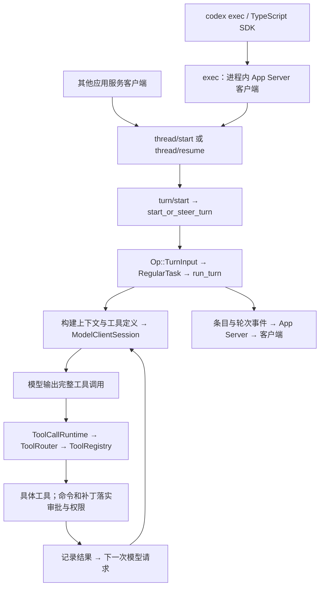
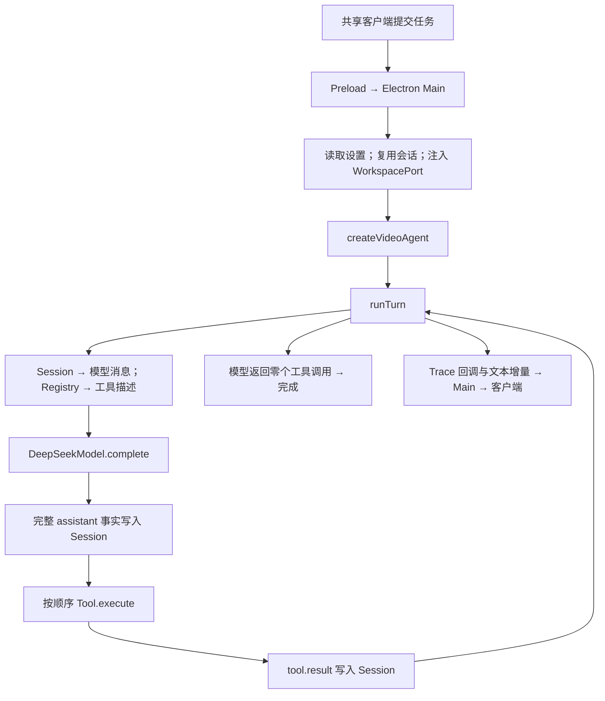

# Codex 源码拆解与 Agent Desktop 逐项对照

分析日期：2026-09-19。本文是带源码证据的对照快照，用于判断现有能力和后续取舍；不替代当前架构文档或阶段执行方案。

## 取样与结论边界

- Codex：`E:/JavaProjects/web-project/codex-harness`，`main`，提交 `78245b47af2a7aafcabe025828ceecca69db4df1`，分析时工作区干净。本次没有更新远端。
- Agent Desktop：`E:/JavaProjects/web-project/agent-desktop`，`feature/local-workspace`，提交 `53290c4f335961cb63195795fad77614ff4af002`，同时分析当前未提交和未跟踪实现。尤其 `packages/local-tools/`、`apps/desktop/src/main/tool-approval.ts` 尚未进入该提交。
- 本文说“已实现”表示当前源码存在真实注册和调用链，不表示已经提交、合并、安装交付或完成真实模型验收。
- 对照范围包括入口、循环、模型、上下文、工具、权限、取消、会话、事件、媒体和验证。Codex 桌面界面的完整实现不在这次开源源码对照范围内；本文没有做界面像素验收。
- 官方边界参考：[开源组件说明](https://developers.openai.com/codex/open-source/)和[应用服务说明](https://developers.openai.com/codex/app-server/)。这两页已在本次读取；具体实现以本地提交为准。源码中存在的能力仍可能受模型、配置、平台或实验开关限制。

主要结论：我们已经拥有通用智能体的基本执行闭环，当前差距集中在通用命令与文件编辑、长上下文管理、运行中交互和更完整的执行事实。现有媒体链路、只追加会话和宿主审批边界值得继续复用。Codex 的完整扩展平台与多执行环境不构成当前必须复制的架构。

## 术语

```text
Term                    中文术语                本文含义
Harness                 智能体执行宿主          围绕模型落实上下文、工具、权限、状态和客户端通信。
Runtime                 运行时                  真正驱动模型和工具完成任务的程序。
App Server              应用服务                Codex 对客户端提供会话、轮次、审批和事件接口的服务。
SDK                     开发工具包              供其他程序调用既有能力的库；本文的 Codex SDK 调用完整运行时。
Thread / Session        会话                    跨多轮保留历史的容器；两项目名称及内部结构并不完全相同。
Turn                    任务轮次                一次用户请求及其后续模型和工具操作。
Step                    模型步骤                我们项目中一次模型响应及其全部工具调用。
Item                    执行条目                Codex 中一项消息、命令、文件变更或工具活动。
Provider                模型适配器              把运行时请求映射为模型供应商协议。
SSE                     服务端事件流            HTTP 响应中连续接收模型增量事件的传输方式。
Approval                操作审批                执行前对某项操作作出授权决定。
Sandbox                 系统沙箱                由操作系统或执行环境限制文件、进程及网络访问。
Token Budget            模型上下文预算          控制一次请求或上下文窗口可容纳的信息量。
Compaction              上下文压缩              缩短后续模型输入，同时保留可追溯的历史和检查点。
Rollout                 会话执行记录            Codex 用于保存和重建会话的持久化事实。
Trace                   诊断追踪                用于定位运行状态和耗时，不自动等于模型历史。
MCP                     模型上下文协议          连接外部工具服务的协议，不天然提供本机沙箱。
Skill                   技能                    按需提供给智能体的指令和配套资源。
Hook                    生命周期钩子            在执行节点介入或要求继续的扩展回调。
IPC                     进程间通信              我们的 Electron 主进程与客户端之间的请求和事件通道。
```

## 先看真实调用链

当前 Codex 已拆分运行时文件，不能套用旧版本围绕 `core/src/codex.rs` 的介绍；该文件在本快照中不存在。



这里的循环边不是固定工作流：模型决定调用什么工具，执行结果推动下一次判断。只有命令、文件补丁等对应执行路径进入工具审批与沙箱编排，不能说所有远端工具都会被本机沙箱约束。

我们当前的正式桌面链路：



入口证据：[Codex 的进程内应用服务客户端](E:/JavaProjects/web-project/codex-harness/codex-rs/exec/src/lib.rs:973)、[Codex 的轮次提交](E:/JavaProjects/web-project/codex-harness/codex-rs/app-server/src/request_processors/turn_processor.rs:651)、[我们的真实任务入口](E:/JavaProjects/web-project/agent-desktop/apps/desktop/src/main/index.ts:340)、[我们的循环](E:/JavaProjects/web-project/agent-desktop/packages/agent-loop/src/index.ts:191)。

## 22 项源码对照

### 01．客户端与运行时的关系

Codex 的 `exec` 入口已经复用应用服务协议；TypeScript SDK 的 `CodexExec.run` 启动本机 `codex exec --experimental-json`，消费执行事件。它调用的是完整智能体，不是单次模型请求。应用服务则直接暴露会话、轮次、审批和事件接口。

我们由 Electron 主进程直接组装并运行自己的 Agent，共享客户端通过有限 IPC 接口交互。`apps/web` 是模拟宿主，不运行同一套真实本地 Agent。

对照判断：现有宿主与核心分离方向成立。如果以后确实选择接入 Codex，应明确为完整运行时接入；不能把 Codex SDK 塞进 `Model.complete`，让 Codex 的循环、工具和权限隐藏在我们的一次模型请求中。本次不增加运行时切换抽象。

证据：[Codex SDK 启动参数](E:/JavaProjects/web-project/codex-harness/sdk/typescript/src/exec.ts:92)、[SDK 启动子进程](E:/JavaProjects/web-project/codex-harness/sdk/typescript/src/exec.ts:196)、[我们的 Agent 依赖](E:/JavaProjects/web-project/agent-desktop/packages/agent/src/index.ts:10)、[Web 模拟执行](E:/JavaProjects/web-project/agent-desktop/apps/web/src/webClientApi.ts:100)。

### 02．任务为何继续、何时结束

Codex `run_turn` 按模型步骤捕获上下文和工具配置。工具调用要求跟进、队列里有新增输入或模型完成事件的 `end_turn=false` 都能让它继续；结束前的钩子也可能提供续行指令。返回文字并不直接意味着结束。

我们每步从会话重建消息，调用模型，执行本响应中的工具，再以 `toolCalls.length === 0` 自然结束。`stepCount` 只是计数；当前没有固定步数上限。Codex 也不能简单概括成“多一个最大步数”。

对照判断：我们的最小闭环已经成立。新增继续条件必须对应当前产品行为；不能为了更像 Codex 先添加目标调度器或生命周期钩子。

证据：[Codex 主循环](E:/JavaProjects/web-project/codex-harness/codex-rs/core/src/session/turn.rs:423)、[Codex 继续条件](E:/JavaProjects/web-project/codex-harness/codex-rs/core/src/session/turn.rs:567)、[Codex 完成事件处理](E:/JavaProjects/web-project/codex-harness/codex-rs/core/src/session/turn.rs:2828)、[我们的停止条件](E:/JavaProjects/web-project/agent-desktop/packages/agent-loop/src/index.ts:275)。

### 03．模型协议、流式输出与用量

Codex 的 `ModelClient` 与每轮 `ModelClientSession` 分开管理；按供应商能力选择 Responses WebSocket 或 HTTP 事件流，处理文本、工具、推理、用量和完成事件。本快照的 `WireApi` 只有 `Responses`，配置 `chat` 会被明确拒绝。

我们使用 DeepSeek Chat Completions，解析文本和工具参数增量，完整响应才回到循环。当前明确发送 `thinking: { type: 'disabled' }`，没有用量或推理摘要契约。HTTP 成功但流截断、缺少完成标记或非正常结束原因仍视为失败。

对照判断：不能认为换一个地址就能让当前 Codex 源码无适配支持 DeepSeek 协议。我们的模型边界较小且独立；后续预算需求应沿它补充真实供应商数据，不复制 Codex 全部传输状态。

证据：[Codex 传输选择](E:/JavaProjects/web-project/codex-harness/codex-rs/core/src/client.rs:2135)、[Codex 协议约束](E:/JavaProjects/web-project/codex-harness/codex-rs/model-provider-info/src/lib.rs:95)、[DeepSeek 流解析](E:/JavaProjects/web-project/agent-desktop/packages/model-deepseek/src/index.ts:272)、[DeepSeek 实际请求](E:/JavaProjects/web-project/agent-desktop/packages/model-deepseek/src/index.ts:382)。

### 04．系统提示词的内容归属与组装

Codex 区分基础模型指令、开发者指令、项目规则、环境、权限和技能等来源。最终请求集中组装，但内容并非全部放在一个巨大常量里；上下文变化会追加为新的事实，尽量保持已有前缀稳定。

我们当前已使用 `video-agent/src/system-prompt.ts` 中的 `GENERAL_RULES + VIDEO_RULES`，通过 `StaticSystemPrompt` 注入。Desktop 的 `buildAgentPrompt` 拼接本轮附件、音轨角色和预设输出位置。旧记录中“提示词仍在 index.ts、抽取尚未实施”的状态已不适用。

对照判断：应继续区分规则的权威来源和单次请求的组装位置。我们已经完成必要的内容归属分离；这并不要求再建一个提示词框架。

证据：[Codex 基础指令优先级](E:/JavaProjects/web-project/codex-harness/codex-rs/core/src/session/mod.rs:710)、[Codex 上下文变化记录](E:/JavaProjects/web-project/codex-harness/codex-rs/core/src/session/mod.rs:4474)、[我们的系统规则](E:/JavaProjects/web-project/agent-desktop/packages/video-agent/src/system-prompt.ts:9)、[Desktop 任务输入](E:/JavaProjects/web-project/agent-desktop/apps/desktop/src/main/agent-task.ts:22)。

### 05．项目指令与技能是否真的进入产品运行时

Codex 沿项目根到工作目录发现项目指令，处理 `AGENTS.override.md`、`AGENTS.md` 等优先级、信任和字节预算；不是自动递归加载所有子目录规则。选中技能后有实际的正文加载与上下文注入路径。

我们仓库中的 `AGENTS.md` 和开发技能目前用于指导开发者；正式产品调用链没有自动发现和注入项目规则、技能正文的实现。

对照判断：这是实际能力缺口，对应已有阶段 45、46。优先借鉴“明确来源、限定发现范围、按需加载”，技能不能成为提高文件或命令权限的途径。

证据：[Codex 项目规则加载](E:/JavaProjects/web-project/codex-harness/codex-rs/core/src/agents_md.rs:58)、[Codex 技能正文](E:/JavaProjects/web-project/codex-harness/codex-rs/ext/skills/src/host_prompt.rs:69)、[我们的正式组装](E:/JavaProjects/web-project/agent-desktop/packages/video-agent/src/index.ts:49)。

### 06．工具定义、注册与真实可调用性

Codex 每步通过 `build_tool_router` 汇集核心、MCP、扩展及动态工具，从同一结果构造模型可见定义。某个处理器文件存在，不代表当前模型可以调用它。

我们用 `InMemoryToolRegistry` 管理实际工具，循环把注册项投影为模型定义，去掉 `execute`。本地五项工具需要 `WorkspacePort`；视觉需要配置密钥；语音需要模型路径。Desktop 提供工作目录端口，当前视频 CLI 不提供。

对照判断：我们已有正确的“注册事实决定可用能力”机制。诊断功能应消费这份事实，不另维护一张手写能力表，也无需为当前工具数量引入动态扩展平台。

证据：[Codex 注册计划](E:/JavaProjects/web-project/codex-harness/codex-rs/core/src/tools/spec_plan.rs:121)、[我们的注册表](E:/JavaProjects/web-project/agent-desktop/packages/tools/src/index.ts:15)、[我们的条件注册](E:/JavaProjects/web-project/agent-desktop/packages/video-agent/src/index.ts:49)。

### 07．目录发现、文本读取与搜索

当前 Codex 核心注册路径没有旧文章中常见的独立 `read_file / grep_files / list_dir` 工具清单；本地读取和搜索可以经命令工具完成。内部文件系统接口或应用服务文件 API 的存在，不等于它们直接成为模型工具；MCP 或动态工具可以另行提供能力。

我们的工作区已有专门的 `list_directory`、`read_file` 和 `search_text`。读取有行号、翻页和长度上限；搜索实际启动随包依赖的 `rgPath`，进行字面匹配并限制数量。超长单行会截断，剩余部分不能靠行分页补读。

对照判断：专用文本工具适合当前受限工作区需求，不因 Codex 常用 shell 就删除它们。源码中已使用 `@vscode/ripgrep`，但安装后资源可用性仍需安装包实测，不能由开发测试替代。

证据：[Codex 核心处理器目录](E:/JavaProjects/web-project/codex-harness/codex-rs/core/src/tools/handlers/mod.rs:1)、[我们的读取工具](E:/JavaProjects/web-project/agent-desktop/packages/local-tools/src/read-file.ts:62)、[我们的搜索进程](E:/JavaProjects/web-project/agent-desktop/packages/local-tools/src/search-text.ts:67)、[搜索包依赖](E:/JavaProjects/web-project/agent-desktop/packages/local-tools/package.json:5)。

### 08．创建文件与修改文件

Codex 的 `apply_patch` 有补丁解析、当前文件验证、安全评估、审批和实际写入链，并产生文件变更事实。多文件补丁失败时可能已有部分变更，源码会保留已提交差异；不能把它描述为自动回滚的原子事务。

我们 `write_text_file` 获批后以 UTF-8 和 `wx` 创建新文件；已有目标不覆盖，缺少父目录不自动创建。当前没有修改已有文本的工具。

对照判断：创建已经有源码链路，修改是阶段 43 的明确缺口。可以借鉴补丁的“针对现有内容验证、呈现实际变更、明确部分结果”，但首版不需要照搬 Codex 全部补丁语法。

证据：[Codex 补丁执行入口](E:/JavaProjects/web-project/codex-harness/codex-rs/core/src/tools/handlers/apply_patch.rs:548)、[Codex 实际补丁写入](E:/JavaProjects/web-project/codex-harness/codex-rs/core/src/tools/runtimes/apply_patch.rs:168)、[我们的创建实现](E:/JavaProjects/web-project/agent-desktop/packages/local-tools/src/write-text-file.ts:59)。

### 09．命令执行与持续进程

Codex 注册 `exec_command`；允许持续执行时还提供 `write_stdin`。进程未在首次等待内结束，可以保留进程标识继续读取或输入；受管配置关闭持续执行时只有一次性命令。命令路径、标准输出、错误输出、退出码和时长都有真实执行载体。

我们当前没有模型可调用的通用命令工具。FFmpeg、Whisper 和 ripgrep 启动固定进程，不等于提供了任意命令执行能力。

对照判断：阶段 44 先实现现有方案规定的一次性 PowerShell 命令、确切审批、输出上限和取消。持久终端是另一项产品行为，当前不引入。

证据：[Codex 命令注册条件](E:/JavaProjects/web-project/codex-harness/codex-rs/core/src/tools/spec_plan.rs:1032)、[Codex 保存持续进程](E:/JavaProjects/web-project/codex-harness/codex-rs/core/src/unified_exec/process_manager.rs:597)、[我们的工具注册范围](E:/JavaProjects/web-project/agent-desktop/packages/video-agent/src/index.ts:49)。

### 10．工作目录与系统沙箱

Codex 分别处理命令 `cwd`、权限判断基准 `sandbox_cwd`、工作区根和网络策略；批准以后仍按权限配置与执行环境决定是否使用沙箱及使用何种沙箱。改变工作目录不自动扩大权限，关闭审批也不必然关闭沙箱。

我们通过 `realpath` 和相对路径范围检查约束本地文本工具，处理父目录、符号链接及 Windows 联接。但媒体、视觉、语音工具没有接入同一个 `WorkspacePort`。Electron 的 `contextIsolation` 与 `nodeIntegration: false` 是渲染进程边界，不是工具进程的系统沙箱。

对照判断：我们当前拥有应用层目录授权，不是统一的操作系统限制。这个范围必须描述准确；若将来增加任意命令，须按现有阶段 44 约束明确完整命令的授权范围，不能靠 `workdir` 宣称安全隔离。

证据：[Codex 命令目录解析](E:/JavaProjects/web-project/codex-harness/codex-rs/core/src/tools/handlers/unified_exec/exec_command.rs:196)、[Codex 平台沙箱选择](E:/JavaProjects/web-project/codex-harness/codex-rs/sandboxing/src/manager.rs:301)、[我们的真实路径范围](E:/JavaProjects/web-project/agent-desktop/packages/local-tools/src/path-scope.ts:33)、[我们的窗口隔离](E:/JavaProjects/web-project/agent-desktop/apps/desktop/src/main/index.ts:498)。

### 11．审批请求承载什么、如何结算

Codex 的工具编排先判断跳过、禁止或需要审批，再进入执行。应用服务有命令与文件变更审批类型，能区分接受、会话级接受、拒绝和取消；具体选项仍由配置和请求决定。

我们用单个宿主审批对象承载当前串行工具的等待。工具持有待执行参数；客户端只能提交当前请求标识和允许/拒绝，取消会结束等待。当前请求只含 `kind + target`，创建审批没有待写正文或差异预览。

对照判断：请求标识和原工具等待的绑定已具备；创建审批不能宣传成完整变更审阅。以后文件编辑和命令执行应把确切内容或命令纳入可审阅对象，沿用现有通道，不先建策略语言和审批数据库。

证据：[Codex 审批与执行分段](E:/JavaProjects/web-project/codex-harness/codex-rs/core/src/tools/orchestrator.rs:122)、[Codex 命令决定类型](E:/JavaProjects/web-project/codex-harness/codex-rs/app-server-protocol/src/protocol/v2/item.rs:66)、[我们的审批生命周期](E:/JavaProjects/web-project/agent-desktop/apps/desktop/src/main/tool-approval.ts:32)、[我们的审批契约](E:/JavaProjects/web-project/agent-desktop/packages/client/src/api.ts:168)。

### 12．工具失败如何让模型修正

Codex 区分可以返回模型的工具失败与核心致命错误；前者形成可见结果供后续判断，后者终止正常执行。沙箱拒绝后的升级尝试也由具体策略控制，不是所有错误自动重试。

我们对未知工具及工具抛出的标准 `Error` 记录失败结果，继续下一步模型；模型调用失败则终止轮次。对同一响应中的多个工具调用，循环仍按顺序执行，因此“前一工具成功才继续”的提示词不等于强制依赖调度。

对照判断：错误进入模型闭环已实现。需要准确区分“工具运行失败”“模型请求失败”“任务取消”，不把所有错误都变为同一种重试，也不宣称已提供工作流依赖执行。

证据：[Codex 工具错误分类](E:/JavaProjects/web-project/codex-harness/codex-rs/core/src/tools/registry.rs:529)、[Codex 错误转结果](E:/JavaProjects/web-project/codex-harness/codex-rs/core/src/tools/parallel.rs:92)、[我们的工具异常处理](E:/JavaProjects/web-project/agent-desktop/packages/agent-loop/src/index.ts:128)、[我们的顺序执行](E:/JavaProjects/web-project/agent-desktop/packages/agent-loop/src/index.ts:267)。

### 13．取消任务与停止进程

Codex 的任务取消会传播令牌并清理活动任务；持续命令的生命周期与轮次不同，源码特意保留持续进程以免轮次中断误杀它；一次性命令取消则显式终止进程。因此“停止”不能统一理解为杀掉全部后台进程。

我们一轮使用一个 `AbortController`，贯穿模型、支持信号的工具和审批。完成的工具结果及产物不回滚；短时目录/文件读取没有各自的可中断执行，依靠循环边界阻止后续操作。关闭窗口先取消，等待结束，再保存状态。

对照判断：我们当前的单轮取消机制符合现有任务形态。阶段 44 必须实测 Windows 命令及子进程收尾；Codex 的持续终端语义不能不加区分地搬过来。

证据：[Codex 任务中断](E:/JavaProjects/web-project/codex-harness/codex-rs/core/src/tasks/mod.rs:904)、[Codex 一次性命令取消](E:/JavaProjects/web-project/codex-harness/codex-rs/core/src/unified_exec/oneshot.rs:75)、[我们的取消入口](E:/JavaProjects/web-project/agent-desktop/apps/desktop/src/main/index.ts:432)、[我们的关闭收尾](E:/JavaProjects/web-project/agent-desktop/apps/desktop/src/main/index.ts:481)。

### 14．运行中追加输入与并行

Codex `turn/steer` 核对目标活动轮次并返回真实接收结果；输入通常在下一次模型请求前进入历史，不修改已经发出的请求。工具执行根据 `supports_parallel` 采用共享或独占准入；允许模型提出多个调用，不等于执行端无条件并行。

我们同时只执行一个活动任务，运行中禁用会话切换、新建和删除；工具串行，无追加输入接口。多会话列表表示保存多个会话，不表示同时运行多个任务。

对照判断：保持当前串行约束即可。只有明确需要边执行边纠正或同时跑多个任务时，才增加接受确认、事件归属和对应调度，不预先添加锁和多代理系统。

证据：[Codex 追加输入](E:/JavaProjects/web-project/codex-harness/codex-rs/app-server/src/request_processors/turn_processor.rs:1020)、[Codex 并行准入](E:/JavaProjects/web-project/codex-harness/codex-rs/core/src/tools/parallel.rs:179)、[我们的活动任务限制](E:/JavaProjects/web-project/agent-desktop/apps/desktop/src/main/index.ts:344)、[我们的会话操作限制](E:/JavaProjects/web-project/agent-desktop/apps/desktop/src/main/index.ts:311)。

### 15．历史事实与模型上下文的关系

Codex 保留执行记录，同时从历史构造模型输入，规范化工具调用与结果配对，并按模型能力处理多模态内容。模型输入是历史的受控投影，不等于界面文本。

我们 `Session` 只追加事件，模型输入由 `recoverSessionEvents` 选择完整步骤后重建。客户端历史不参与模型上下文。没有 `step.completed` 的整步助手消息、调用和结果都会排除，原事件仍保留。

例如同一步工具 A 已创建文件，工具 B 等待时取消：原始会话和产物投影可保留 A 的成功事实，但下一轮模型不会收到这个未完成步骤的全部内容。不能把“产物保留”说成“模型精确续跑了中断现场”。

对照判断：事实源与投影分离方向一致，恢复粒度不同。是否更细粒度保留中断步骤，须由真实续做需求决定，而不是先引入事务日志框架。

证据：[Codex 历史规范化](E:/JavaProjects/web-project/codex-harness/codex-rs/core/src/context_manager/history.rs:800)、[我们的恢复投影](E:/JavaProjects/web-project/agent-desktop/packages/session/src/index.ts:64)、[我们的消息重建](E:/JavaProjects/web-project/agent-desktop/packages/agent-loop/src/index.ts:56)。

### 16．上下文预算与压缩

Codex 会估算/记录上下文用量、限制工具输出，并在具体阈值和供应商能力下选择远程压缩或本地总结；压缩后保存替换历史及检查点。名为 `TokenBudget` 的特殊窗口重置路径又是独立机制，不能把所有路径都说成同一种自动摘要。

我们本地读取和搜索已有输出上限，但每次仍重建全部可用会话；没有模型级令牌预算、压缩或摘要。工具侧截断与会话整体预算是不同层面。

对照判断：已有阶段 47 先做最小预算，符合当前情况。不要直接跳到自动摘要；应先以真实模型限制和工具输出量建立可验证边界，保留原始 Session 事实。

证据：[Codex 压缩选择](E:/JavaProjects/web-project/codex-harness/codex-rs/core/src/session/turn.rs:1446)、[Codex 压缩历史记录](E:/JavaProjects/web-project/codex-harness/codex-rs/core/src/session/mod.rs:3936)、[我们的全历史输入](E:/JavaProjects/web-project/agent-desktop/packages/agent-loop/src/index.ts:217)、[我们的读取上限](E:/JavaProjects/web-project/agent-desktop/packages/local-tools/src/read-file.ts:13)。

### 17．持久化、恢复与崩溃耐受范围

Codex 普通本地持久化链路以 JSONL 执行记录为权威；分页历史的 SQLite 是可重建投影，写入顺序明确要求先刷新权威历史，再更新投影。恢复时重建模型历史及上下文基线，而不仅是聊天展示。

我们以 `session-state.json` 保存多会话、附件、目录和客户端状态，通过同目录临时文件写完再重命名替换。启动恢复会话事实；没有逐模型步骤的持久执行检查点，也不会重启后继续运行旧进程或审批。正常关闭收尾与突然崩溃的恢复保证不能混同。

对照判断：当前快照适合已有单机规模，不必为了对齐目录结构引入 SQLite。需要明确“保存成功后可恢复”与“任何时刻崩溃都无损”的差别。

证据：[Codex 权威历史和投影顺序](E:/JavaProjects/web-project/codex-harness/codex-rs/thread-store/src/local/live_writer.rs:317)、[Codex 恢复入口](E:/JavaProjects/web-project/codex-harness/codex-rs/core/src/session/mod.rs:1564)、[我们的磁盘读写](E:/JavaProjects/web-project/agent-desktop/apps/desktop/src/main/session-persistence.ts:539)、[我们的启动恢复](E:/JavaProjects/web-project/agent-desktop/apps/desktop/src/main/index.ts:110)。

### 18．执行事件、活动展示与诊断日志

Codex 应用服务用会话、轮次和条目标识关联事件。`ThreadItem` 分别表示消息、推理、命令、文件变更、MCP 调用等，并有开始、增量和完成通知。命令条目包含实际命令、目录、输出、退出码和时长。协议声明存在不代表每个模型或模式都会生成所有条目。

我们已有 `analysis | tool` 活动、文件引用、耗时、实时文本和审批事件。`analysis` 来源是 `model.started/completed/failed` 的状态投影，不是模型推理内容。运行事件依赖单活动任务定位，文本增量没有独立会话/轮次/条目标识。JSONL Trace 另存诊断元数据，不记录完整工具内容，也不作为模型历史。

对照判断：不能说我们“只有工具活动”，也不能说已有 Codex 完整分项轨迹。文件修改、命令加入时，应把真实结果逐项接入现有契约；并行任务未提出前，不为了未来并发扩大整个事件总线。

证据：[Codex 条目结构](E:/JavaProjects/web-project/codex-harness/codex-rs/app-server-protocol/src/protocol/v2/item.rs:236)、[Codex 增量身份](E:/JavaProjects/web-project/codex-harness/codex-rs/app-server-protocol/src/protocol/v2/item.rs:1432)、[Codex 事件转发](E:/JavaProjects/web-project/codex-harness/codex-rs/app-server/src/bespoke_event_handling.rs:1073)、[我们的事件契约](E:/JavaProjects/web-project/agent-desktop/packages/client/src/api.ts:151)、[我们的活动投影](E:/JavaProjects/web-project/agent-desktop/apps/desktop/src/main/agent-activity.ts:88)、[我们的日志写入](E:/JavaProjects/web-project/agent-desktop/packages/execution-trace/src/index.ts:6)。

### 19．产物与文件变更的事实来源

Codex 的文件补丁生成结构化 `FileChange`，命令执行另有状态与输出；两者不应仅凭助手最终文字推断。应用服务也有附件接口，但不能据此认定所有命令会自动发现并登记交付文件。

我们新成功结果用 `ToolResult.artifacts` 明确报告交付文件，Desktop 从对应工具结果生成产物；失败或取消也保留本轮之前已经成功的产物。旧媒体历史仍有按成功调用的 `outputPath` 读取投影。

对照判断：我们的产物权威链已经适合视频与文本创建，应保留。阶段 43 的编辑是文件变更，阶段 44 的退出码是执行结果，都不应自动冒充新产物。

证据：[Codex 文件变更条目](E:/JavaProjects/web-project/codex-harness/codex-rs/app-server-protocol/src/protocol/v2/item.rs:326)、[我们的成功结果契约](E:/JavaProjects/web-project/agent-desktop/packages/model/src/index.ts:5)、[我们的产物提取](E:/JavaProjects/web-project/agent-desktop/apps/desktop/src/main/agent-task.ts:92)。

### 20．视频、语音与视觉的产品能力

Codex 有命令、图片查看和扩展工具基础，具体可用性由注册、配置和环境决定。本次核心注册链未见与我们完全相同的“抽音频—本地语音时间轴—语义裁剪—拼接”专用工具组合；这不表示用户不能通过脚本和外部工具完成视频任务。

我们正式组装直接注册 11 项 FFmpeg 工具，视觉和 Whisper 按配置加入；提示词规定由主模型结合语音时间轴及必要视觉证据决定剪辑，视觉/语音工具只提供观察。媒体进程使用固定命令与参数，写出拒绝覆盖现有文件。

对照判断：这是我们有价值的业务实现，不应为了变成通用编码客户端而降级成模型随意拼 FFmpeg 命令。通用本地工具与视频工具可以继续进入同一循环。

证据：[Codex 图片工具注册](E:/JavaProjects/web-project/codex-harness/codex-rs/core/src/tools/spec_plan.rs:1226)、[我们的媒体注册](E:/JavaProjects/web-project/agent-desktop/packages/video-agent/src/index.ts:59)、[我们的媒体执行边界](E:/JavaProjects/web-project/agent-desktop/packages/video-ffmpeg/src/index.ts:28)、[我们的拒绝覆盖](E:/JavaProjects/web-project/agent-desktop/packages/video-ffmpeg/src/index.ts:119)、[我们的语义剪辑规则](E:/JavaProjects/web-project/agent-desktop/packages/video-agent/src/system-prompt.ts:20)。

### 21．外部工具、多代理与扩展平台

Codex 有真实 MCP 调用、技能扩展、动态工具和子智能体路径；暴露范围依赖配置、模型能力、服务连接及版本选择。MCP 服务端副作用不天然受本机命令沙箱约束；源码中的默认开关也不证明某次会话已启用能力。

我们的正式运行时没有 MCP 接入、技能发现或子智能体编排，工具以应用组装时注册为主。

对照判断：这些是能力差异，不是当前架构缺陷。项目规则明确禁止无当前消费者的插件市场、多运行时和平台预设计；继续后置，等具体服务或独立任务确有需求时再设计。

证据：[Codex MCP 调用入口](E:/JavaProjects/web-project/codex-harness/codex-rs/core/src/tools/handlers/mcp.rs:176)、[Codex 子智能体创建](E:/JavaProjects/web-project/codex-harness/codex-rs/core/src/tools/handlers/multi_agents_v2/spawn.rs:198)、[Codex 技能扩展安装](E:/JavaProjects/web-project/codex-harness/codex-rs/app-server/src/extensions.rs:103)、[我们的实际工具全集入口](E:/JavaProjects/web-project/agent-desktop/packages/video-agent/src/index.ts:49)。

### 22．测试证据与最终交付

Codex 有核心工具调用、取消、压缩恢复和应用服务协议的集成测试。本次只定位并阅读相关源码和测试，没有编译或执行其 Rust 测试，也没有验证 Codex 在本机各功能的实际可用配置。

我们已有循环、供应商、会话、本地文件、审批及展示投影测试。本次运行下面的聚焦测试，13 个文件、204 项通过。它证明这些既有测试在当前工作区通过，不等于全量工程门禁、真实模型、Electron 可见界面或安装包验收通过。

对照判断：两边最值得对齐的是可重复的行为证据。不能用测试文件数量、源码行数或目录规模计算“达到 Codex 的百分之多少”。

证据：[Codex 中断验收用例](E:/JavaProjects/web-project/codex-harness/codex-rs/app-server/tests/suite/v2/turn_interrupt.rs:35)、[Codex 追加输入用例](E:/JavaProjects/web-project/codex-harness/codex-rs/app-server/tests/suite/v2/turn_steer.rs:218)、[我们的循环测试](E:/JavaProjects/web-project/agent-desktop/packages/agent-loop/tests/run-turn.test.ts:63)、[我们的文件创建测试](E:/JavaProjects/web-project/agent-desktop/packages/local-tools/tests/write-text-file.test.ts:71)、[我们的审批测试](E:/JavaProjects/web-project/agent-desktop/apps/desktop/tests/tool-approval.test.ts:11)。

## 对现有开发顺序的建议

沿用[通用客户端执行方案](E:/JavaProjects/web-project/agent-desktop/docs/superpowers/plans/2026-09-18-general-agent-client-plan.md:227)，本次不另立第二份路线图：

1. 最新根 `AGENTS.md` 已将阶段 42 标为完成。先核对并保留该阶段已有的创建、审批、写入、产物和重启恢复验收记录，再按现有方案推进阶段 43；实现、真实验收与 Git 集成状态分别记录。本次未做桌面验收不表示过去没有验收，阶段完成也不等于当前工作区已经提交。
2. 阶段 43 的价值是安全地修改已有文本。借鉴补丁前核对当前内容、展示确切差异、保留真实变更结果；不实现完整补丁平台。
3. 阶段 44 的价值是得到真实命令输出和退出状态。复用审批与取消，实测超时和 Windows 子进程收尾；首版保持一次性前台命令。
4. 阶段 45–46 再增加项目规则和按需技能；阶段 47 引入可信的最小上下文预算。Codex 的自动压缩仅作为后续参考，不越过现有阶段直接实现。
5. 多代理、持久终端、MCP、插件市场、多运行时、通用策略引擎及数据库投影，均不因本报告而进入当前实施范围。

现有设计应保留的部分：供应商无关的核心契约；由工具返回事实、模型决定下一步；只追加 Session 与展示投影分离；宿主控制审批；成功工具明确报告产物；专用媒体理解和剪辑链路。

## 本次验证记录

本机 Node.js 为 `v24.13.1`，pnpm 为 `11.22.0`。Node.js 小于工程文档正式基线 `24.19.0`，因此以下结果不是与持续集成环境完全相同的证据。

执行命令：

```powershell
pnpm exec vitest run packages/agent-loop/tests/run-turn.test.ts packages/session/tests/session.test.ts packages/model-deepseek/tests/deepseek-model.test.ts packages/local-tools/tests apps/desktop/tests/tool-approval.test.ts apps/desktop/tests/agent-activity.test.ts apps/desktop/tests/session-persistence.test.ts packages/video-agent/tests/video-agent.test.ts
```

结果：退出码 0；13 个测试文件通过；204 项测试通过；测试运行报告耗时 1.30 秒。范围包括真实内部组件、测试夹具，以及相应的模拟模型或外部边界替身，不是付费外部服务验收。

本次未执行：`pnpm check` 全量工程门禁、Codex 编译及 Rust 测试、真实 DeepSeek/视觉模型任务、真实视频处理、Electron 可见界面、Windows 安装包验收。未修改运行时代码，未提交、推送或合并。

文档交付检查：核对本地源码链接的文件与行号范围，检查本报告差异格式，复查两仓库版本状态。本文是研究证据；后续实现仍以当时源码及对应阶段验收为准。
